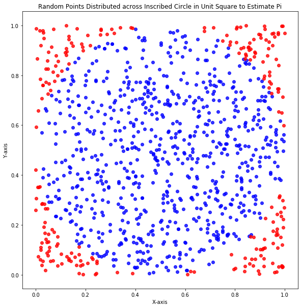

# To celebrate the end of your first week: a long warmup!

# Part 1: Numpy practice

(If you get stuck at one part, try the other part)

Run the cell below to load the machinery for testing your work, and then 

- import the numpy library with the alias 'np'


```python
#Run this cell without changes

from test_background import test_dict, run_test
```


```python
#__SOLUTION__

#Run this cell without changes

from test_background import test_dict, run_test
```


```python
#Your code here
```


```python
#__SOLUTION__

#data manip
import numpy as np

#imports for testing
import pickle as pkl
from test_background import pkl_dump
```

Create a variable called x that is a list of 100 0s


```python
#Your code here
```


```python
#__SOLUTION__

x = [num for num in range(0,100)]

#or
x = [].extend(
    range(0,100)
    )

#or
x = []

for num in range(0,100):
    x.append(num)
    
#or

x = [0]*100

#used for testing
# pkl_dump([(x, 'x1')])
x
```


    [0,
     0,
     0,
     0,
     0,
     0,
     0,
     0,
     0,
     0,
     0,
     0,
     0,
     0,
     0,
     0,
     0,
     0,
     0,
     0,
     0,
     0,
     0,
     0,
     0,
     0,
     0,
     0,
     0,
     0,
     0,
     0,
     0,
     0,
     0,
     0,
     0,
     0,
     0,
     0,
     0,
     0,
     0,
     0,
     0,
     0,
     0,
     0,
     0,
     0,
     0,
     0,
     0,
     0,
     0,
     0,
     0,
     0,
     0,
     0,
     0,
     0,
     0,
     0,
     0,
     0,
     0,
     0,
     0,
     0,
     0,
     0,
     0,
     0,
     0,
     0,
     0,
     0,
     0,
     0,
     0,
     0,
     0,
     0,
     0,
     0,
     0,
     0,
     0,
     0,
     0,
     0,
     0,
     0,
     0,
     0,
     0,
     0,
     0,
     0]


```python
#test by running this cell

run_test(x, 'x1')
```


```python
#__SOLUTION__

#test by running this cell

run_test(x, 'x1')
```


    'Hey, you did it.  Good job.'


Find another way to create a list of 100 0s; assign it to a new variable called y


```python
#Your code here
```


```python
#__SOLUTION__

y = [num for num in range(0,100)]

#or
y = [].extend(
    range(0,100)
    )

#or
y = []

for num in range(0,100):
    y.append(num)
    
#or

y = [0]*100

#used for testing
# pkl_dump([(y, 'y1')])
y
```


    [0,
     0,
     0,
     0,
     0,
     0,
     0,
     0,
     0,
     0,
     0,
     0,
     0,
     0,
     0,
     0,
     0,
     0,
     0,
     0,
     0,
     0,
     0,
     0,
     0,
     0,
     0,
     0,
     0,
     0,
     0,
     0,
     0,
     0,
     0,
     0,
     0,
     0,
     0,
     0,
     0,
     0,
     0,
     0,
     0,
     0,
     0,
     0,
     0,
     0,
     0,
     0,
     0,
     0,
     0,
     0,
     0,
     0,
     0,
     0,
     0,
     0,
     0,
     0,
     0,
     0,
     0,
     0,
     0,
     0,
     0,
     0,
     0,
     0,
     0,
     0,
     0,
     0,
     0,
     0,
     0,
     0,
     0,
     0,
     0,
     0,
     0,
     0,
     0,
     0,
     0,
     0,
     0,
     0,
     0,
     0,
     0,
     0,
     0,
     0]


```python
#test by running this cell

run_test(y, 'y1')
```


```python
#__SOLUTION__

#test by running this cell

run_test(y, 'y1')
```


    'Hey, you did it.  Good job.'


Turn x and y into numpy arrays


```python
#Your code here
```


```python
#__SOLUTION__

x = np.array(x)

y = np.array(y)

#used for testing
# pkl_dump([pair for pair in zip([x, y], ['x2', 'y2'])])
x,y
```


    (array([0, 0, 0, 0, 0, 0, 0, 0, 0, 0, 0, 0, 0, 0, 0, 0, 0, 0, 0, 0, 0, 0,
            0, 0, 0, 0, 0, 0, 0, 0, 0, 0, 0, 0, 0, 0, 0, 0, 0, 0, 0, 0, 0, 0,
            0, 0, 0, 0, 0, 0, 0, 0, 0, 0, 0, 0, 0, 0, 0, 0, 0, 0, 0, 0, 0, 0,
            0, 0, 0, 0, 0, 0, 0, 0, 0, 0, 0, 0, 0, 0, 0, 0, 0, 0, 0, 0, 0, 0,
            0, 0, 0, 0, 0, 0, 0, 0, 0, 0, 0, 0]),
     array([0, 0, 0, 0, 0, 0, 0, 0, 0, 0, 0, 0, 0, 0, 0, 0, 0, 0, 0, 0, 0, 0,
            0, 0, 0, 0, 0, 0, 0, 0, 0, 0, 0, 0, 0, 0, 0, 0, 0, 0, 0, 0, 0, 0,
            0, 0, 0, 0, 0, 0, 0, 0, 0, 0, 0, 0, 0, 0, 0, 0, 0, 0, 0, 0, 0, 0,
            0, 0, 0, 0, 0, 0, 0, 0, 0, 0, 0, 0, 0, 0, 0, 0, 0, 0, 0, 0, 0, 0,
            0, 0, 0, 0, 0, 0, 0, 0, 0, 0, 0, 0]))


```python
#run this cell to test yer x

run_test(x, 'x2')
```


```python
#__SOLUTION__

run_test(x, 'x2')
```


    'Hey, you did it.  Good job.'


```python
#run this cell to test yer y

run_test(y, 'y2')
```


```python
#__SOLUTION__

run_test(y, 'y2')
```


    'Hey, you did it.  Good job.'


In both x and y, insert all of the first 100 [positive integers](https://mathworld.wolfram.com/PositiveInteger.html) in-between the 0s

With x, start inserting at index 0

With y, start at index 1

*Hint: couple ways to do this, but [here's one](https://numpy.org/doc/1.18/reference/generated/numpy.insert.html)*


```python
#Your code here
```


```python
#__SOLUTION__

x = np.insert(x, range(0, 100), range(1,101)) 

y = np.insert(y, range(1,101), range(1,101))

#used for testing
# pkl_dump([pair for pair in zip([x, y], ['x3', 'y3'])])

x,y
```


    (array([  1,   0,   2,   0,   3,   0,   4,   0,   5,   0,   6,   0,   7,
              0,   8,   0,   9,   0,  10,   0,  11,   0,  12,   0,  13,   0,
             14,   0,  15,   0,  16,   0,  17,   0,  18,   0,  19,   0,  20,
              0,  21,   0,  22,   0,  23,   0,  24,   0,  25,   0,  26,   0,
             27,   0,  28,   0,  29,   0,  30,   0,  31,   0,  32,   0,  33,
              0,  34,   0,  35,   0,  36,   0,  37,   0,  38,   0,  39,   0,
             40,   0,  41,   0,  42,   0,  43,   0,  44,   0,  45,   0,  46,
              0,  47,   0,  48,   0,  49,   0,  50,   0,  51,   0,  52,   0,
             53,   0,  54,   0,  55,   0,  56,   0,  57,   0,  58,   0,  59,
              0,  60,   0,  61,   0,  62,   0,  63,   0,  64,   0,  65,   0,
             66,   0,  67,   0,  68,   0,  69,   0,  70,   0,  71,   0,  72,
              0,  73,   0,  74,   0,  75,   0,  76,   0,  77,   0,  78,   0,
             79,   0,  80,   0,  81,   0,  82,   0,  83,   0,  84,   0,  85,
              0,  86,   0,  87,   0,  88,   0,  89,   0,  90,   0,  91,   0,
             92,   0,  93,   0,  94,   0,  95,   0,  96,   0,  97,   0,  98,
              0,  99,   0, 100,   0]),
     array([  0,   1,   0,   2,   0,   3,   0,   4,   0,   5,   0,   6,   0,
              7,   0,   8,   0,   9,   0,  10,   0,  11,   0,  12,   0,  13,
              0,  14,   0,  15,   0,  16,   0,  17,   0,  18,   0,  19,   0,
             20,   0,  21,   0,  22,   0,  23,   0,  24,   0,  25,   0,  26,
              0,  27,   0,  28,   0,  29,   0,  30,   0,  31,   0,  32,   0,
             33,   0,  34,   0,  35,   0,  36,   0,  37,   0,  38,   0,  39,
              0,  40,   0,  41,   0,  42,   0,  43,   0,  44,   0,  45,   0,
             46,   0,  47,   0,  48,   0,  49,   0,  50,   0,  51,   0,  52,
              0,  53,   0,  54,   0,  55,   0,  56,   0,  57,   0,  58,   0,
             59,   0,  60,   0,  61,   0,  62,   0,  63,   0,  64,   0,  65,
              0,  66,   0,  67,   0,  68,   0,  69,   0,  70,   0,  71,   0,
             72,   0,  73,   0,  74,   0,  75,   0,  76,   0,  77,   0,  78,
              0,  79,   0,  80,   0,  81,   0,  82,   0,  83,   0,  84,   0,
             85,   0,  86,   0,  87,   0,  88,   0,  89,   0,  90,   0,  91,
              0,  92,   0,  93,   0,  94,   0,  95,   0,  96,   0,  97,   0,
             98,   0,  99,   0, 100]))


```python
#run this cell to test yer x

run_test(x, 'x3')
```


```python
#__SOLUTION__

run_test(x, 'x3')
```


    'Hey, you did it.  Good job.'


```python
#run this cell to test yer y

run_test(y, 'y3')
```


```python
#__SOLUTION__

run_test(y, 'y3')
```


    'Hey, you did it.  Good job.'


Remove all the 0s from both x and y

Use different methods of removal for x and y


```python
#Your code here
```


```python
#__SOLUTION__

x = x[x!=0]

y = y[1::2]

#used for testing
# pkl_dump([pair for pair in zip([x, y], ['x4', 'y4'])])

x,y
```


    (array([  1,   2,   3,   4,   5,   6,   7,   8,   9,  10,  11,  12,  13,
             14,  15,  16,  17,  18,  19,  20,  21,  22,  23,  24,  25,  26,
             27,  28,  29,  30,  31,  32,  33,  34,  35,  36,  37,  38,  39,
             40,  41,  42,  43,  44,  45,  46,  47,  48,  49,  50,  51,  52,
             53,  54,  55,  56,  57,  58,  59,  60,  61,  62,  63,  64,  65,
             66,  67,  68,  69,  70,  71,  72,  73,  74,  75,  76,  77,  78,
             79,  80,  81,  82,  83,  84,  85,  86,  87,  88,  89,  90,  91,
             92,  93,  94,  95,  96,  97,  98,  99, 100]),
     array([  1,   2,   3,   4,   5,   6,   7,   8,   9,  10,  11,  12,  13,
             14,  15,  16,  17,  18,  19,  20,  21,  22,  23,  24,  25,  26,
             27,  28,  29,  30,  31,  32,  33,  34,  35,  36,  37,  38,  39,
             40,  41,  42,  43,  44,  45,  46,  47,  48,  49,  50,  51,  52,
             53,  54,  55,  56,  57,  58,  59,  60,  61,  62,  63,  64,  65,
             66,  67,  68,  69,  70,  71,  72,  73,  74,  75,  76,  77,  78,
             79,  80,  81,  82,  83,  84,  85,  86,  87,  88,  89,  90,  91,
             92,  93,  94,  95,  96,  97,  98,  99, 100]))


```python
#run this cell to test yer x

run_test(x, 'x4')
```


```python
#__SOLUTION__

run_test(x, 'x4')
```


    'Hey, you did it.  Good job.'


```python
#run this cell to test yer y

run_test(y, 'y4')
```


```python
#__SOLUTION__

run_test(y, 'y4')
```


    'Hey, you did it.  Good job.'


# Part 2: Estimating pi (with vis!)

(This is a little bit more math-y than the content we've covered so far)

First import pyplot from matplotlib under the alias plt

Also, run the commend %matplotlib inline so that jupyter renders the plots inside the notebook


```python
#Your code here
```


```python
#__SOLUTION__

#data viz
import matplotlib.pyplot as plt

#jn command that renders matplotlib inline
%matplotlib inline
```

Picture a circle perfectly circumscribed inside a unit square

or run the cell below


```python
#run this cell without changes

square = plt.Rectangle((0,0), 1,1, fill=False, color='blue')
circle = plt.Circle((.5, .5), .5, color='yellow')

fig, ax = plt.subplots()
ax.add_artist(square)
ax.add_artist(circle)

#set the axis a little beyond the square
ax.set_xlim(right=1.5)
ax.set_ylim(top=1.5)

#make the aspect ratios on dimensions the same
ax.set_aspect('equal')

#remove the border from the top and right side of the figure
ax.spines['top'].set_visible(False)
ax.spines['right'].set_visible(False)

plt.show()
```





```python
#__SOLUTION__

#run this cell without changes

square = plt.Rectangle((0,0), 1,1, fill=False, color='blue')
circle = plt.Circle((.5, .5), .5, color='yellow')

fig, ax = plt.subplots()
ax.add_artist(square)
ax.add_artist(circle)

#set the axis a little beyond the square
ax.set_xlim(right=1.5)
ax.set_ylim(top=1.5)

#make the aspect ratios on dimensions the same
ax.set_aspect('equal')

#remove the border from the top and right side of the figure
ax.spines['top'].set_visible(False)
ax.spines['right'].set_visible(False)

plt.show()
```


#### Math refresher

The area of the unit square is 1

The radius of the circle is $\frac{1}{2}$, and the area of the circle is $\pi \times (\frac{1}{2})^2 = \frac{\pi}{4}$

If we randomly throw points inside the square: 

$ \lim \limits_{points \to \infty} ($area covered by all points$) = 1 $

and

$ \lim \limits_{{points} \to \infty} ($area covered by points in circle$) = \frac{\pi}{4} $

So, if we randomly throw *a finite number* of points in the square,

$$\frac{\#ofCircle Points}{\#ofTotal Points} \approx \frac{\pi}{4}$$

and

$$ 4 \times \frac{\#ofCircle Points}{\#ofTotal Points} \approx \pi $$

#### Look just tell me what we're doing here

We're going to create a plot that, inside of a unit square whose lower-left corner is at (0,0):
- plots 1000 random points
- colors them differently if they're inside or outside an inscribed circle

Then, we'll calculate our estimate for pi 

Two s t r e t c h goals:
- calculate the error of the estimate
- turn our work into a function that can recreate what we've done with an arbitrary number of points

#### Let's graph

First we're going to create the points to throw inside the square.

- Use numpy to create a variable `x` that has 1000 randomly drawn floats (a numerical data type which has decimals, as opposed to `integers` which don't) between 0 and 1.

- Use numpy to creat another variable `y` that has a different set of 1000 randomly-drawn floats b/t 0 and 1.

These are the x and y coordinates for the random points we'll throw at the square and inscribed circle

- Also, run `np.random.seed(33)` at the top of the cell

This "seeds" the pseudorandom number generator to produce the same numbers each time the variables are instantiated

[*Hint*](https://numpy.org/devdocs/reference/random/generated/numpy.random.random.html?highlight=random%20random#numpy.random.random)


```python
#Your code here
```


```python
#__SOLUTION__
np.random.seed(33)
x = np.random.random(int(1000))
y = np.random.random(int(1000))

#used for testing
# pkl_dump([pair for pair in zip([x, y], ['x5', 'y5'])])
```


```python
#run this cell to check yer x

run_test(x, 'x5')
```


```python
#__SOLUTION__

run_test(x, 'x5')
```


    'Hey, you did it.  Good job.'


```python
#run this cell to check yer y

run_test(y, 'y5')
```


```python
#__SOLUTION__

run_test(y, 'y5')
```


    'Hey, you did it.  Good job.'


The x and y coordinates of the points inside the circle are 
$$ (x^2 + y^2)<=\frac{1}{2} $$

Select all the points in x inside the circle and assign them to the variable inside_x

Do the same thing for the points in y, and assign them to the variable inside_y


*Hint 1: For 1D arrays, addition and multiplication operates element by element.  Boolean selection of a 1D array also operates element by element.* 

*Eg if `ex1 = np.array([1,2,3])` and `ex2 = np.array([5,6,7])`*, 

`ex1[ex1*5+ex2*10<80]`
= 

"at each index value, 

if (the value of ex1 at that index)*5 +

(the value of ex2 at that index)*10 < 80,

include the value of ex1 at that index" 

= 

`[1,2]`


*Hint 2: the formula for a circle centered at (h,k) with radius r is* 
    $$(x-h)^2 + (y-k)^2 = r^2$$
*Where is the center of a circle inscribed in a unit square whose lower-left corner is at (0,0)?  Are points inside the circle greater than or less than $r^2$?*


```python
#Your code here
```


```python
#__SOLUTION__

inside_x,  inside_y  = x[(x-.5)**2+(y-.5)**2<(.5)**2], y[(x-.5)**2+(y-.5)**2<(.5)**2]

#used for testing
# pkl_dump([pair for pair 
#           in zip(
#               [inside_x, inside_y], 
#               ['inside_x', 'inside_y']
#           )
#          ]
# )

```


```python
#run this cell to check inside_x

run_test(inside_x, 'inside_x')
```


```python
#__SOLUTION__
run_test(inside_x, 'inside_x')
```


    'Hey, you did it.  Good job.'


```python
#run this cell to check inside_y

run_test(inside_y, 'inside_y')
```


```python
#__SOLUTION__
run_test(inside_y, 'inside_y')
```


    'Hey, you did it.  Good job.'


Do the same thing for the points that lie within the square but outside the circle

Ie, select all the points in x and y that satisfy the condition
$$ (x^2 + y^2)>\frac{1}{2} $$
assign them to the variables outside_x and outside_y, respectively


```python
#Your code here
```


```python
#__SOLUTION__

outside_x, outside_y = x[(x-.5)**2+(y-.5)**2>(.5)**2], y[(x-.5)**2+(y-.5)**2>(.5)**2]

#used for tests
# pkl_dump([pair for pair 
#           in zip(
#               [outside_x, outside_y], 
#               ['outside_x', 'outside_y']
#           )
#          ]
# )

```


```python
# #run this cell to check outside_x

run_test(outside_x, 'outside_x')
```


```python
#__SOLUTION__

#run this cell to check outside_x

run_test(outside_x, 'outside_x')
```


    'Hey, you did it.  Good job.'


```python
#run this cell to check outside_y

run_test(outside_y, 'outside_y')
```


```python
#__SOLUTION__

#run this cell to check outside_y

run_test(outside_y, 'outside_y')
```


    'Hey, you did it.  Good job.'


Now, create a scatter plot of the "inside circle" points.  Color them blue, with alpha=.8 and edgecolor=None.

Create another scatter plot of the "outside circle" points.  Color them red, same alpha / edgecolor as above.

Plot both scatter plots in the same graph.

Call the title of the graph "Random Points Distributed across Inscribed Circle in Unit Square to Estimate Pi".  


```python
#Your code here
```


```python
#__SOLUTION__

fig, ax = plt.subplots(figsize=(20,10))

ax.scatter(inside_x, inside_y, color='b', alpha=.8, edgecolor=None)
ax.scatter(outside_x, outside_y, color='r', alpha=.8, edgecolor=None)
ax.set_aspect('equal')
ax.set_xlabel('X-axis')
ax.set_ylabel('Y-axis')
ax.set_title('Random Points Distributed across Inscribed Circle in Unit Square to Estimate Pi')


plt.savefig('viz/delicious_pi.png')
plt.show()
```


You should produce a figure like the one below (which has a figsize(20,10) and used ax.set_aspect('equal'), fyi)


#### Calculate Estimate

Now, calculate your $\pi$ estimate

Create the following variables:
- the number of pts inside the circle
    - name this variable pts_in_circle
    
    
- the number of pts outside the circle
    - name this variable pts_out_circle
    
    
- an estimate for $\pi$ that uses pts_in_circle and pts_out_circle
    - name this variable pi_est

**S t r e t c h goal 1**
    
- a calculation of the pct error of pi_est 
    - name this variable pi_est_error_pct
    
Print a sentence using the above variables that includes the estimate of pi and how many points it's based on 

(and the error, if you get that far)


```python
#Your code here
```


```python
#__SOLUTION__

pts_in_circle = len(inside_x)
pts_out_circle = len(outside_x)

pi_est = 4*(pts_in_circle)/(pts_in_circle+pts_out_circle)
pi_est_error_pct = (abs(pi_est-np.pi)/np.pi)*100

pi_est_error_pct_rounded = np.round(pi_est_error_pct*100)/100

print(
f'''
Using points from above graph, 
estimate of pi based on {pts_in_circle+pts_out_circle} points 
is {pi_est}, w/ {pi_est_error_pct_rounded} % error
'''
)

#used for tests
objects = [
    pts_in_circle, 
    pts_out_circle,
    pi_est,
    pi_est_error_pct,
    pi_est_error_pct_rounded
]

obj_names = [
    'pts_in_circle',
    'pts_out_circle',
    'pi_est',
    'pi_est_error_pct',
    'pi_est_error_pct_rounded'
]
# pkl_dump([pair for pair in zip(objects, obj_names)])

objects=objects[:-2]
obj_names = obj_names[:-2]
```

    
    Using points from above graph, 
    estimate of pi based on 1000 points 
    is 3.052, w/ 2.85 % error
    


```python
#run this cell to test pts_in_circle, pts_out_circle, pi_est

[
    print(pair[1]+f'? {run_test(pair[0], pair[1])}')
    for pair in 
    zip(objects, obj_names)
]
print()
```


```python
#__SOLUTION__

[
    print(pair[1]+'? ', run_test(pair[0], pair[1]))
    for pair in
    zip(objects, obj_names)
    
]
print()
```

    pts_in_circle?  Hey, you did it.  Good job.
    pts_out_circle?  Hey, you did it.  Good job.
    pi_est?  Hey, you did it.  Good job.
    


```python
#run this cell to test pct error

run_test(pi_est_error_pct, 'pi_est_error_pct')
```


```python
#__SOLUTION__
run_test(pi_est_error_pct, 'pi_est_error_pct')
```


    'Hey, you did it.  Good job.'


```python
#run this cell to test rounded pct error

run_test(pi_est_error_pct_rounded, 'pi_est_error_pct_rounded')
```


```python
#__SOLUTION__

run_test(pi_est_error_pct_rounded, 'pi_est_error_pct_rounded')
```


    'Hey, you did it.  Good job.'


**S t r e t c h goal 2**


Turn your work into a function that:

- can take as a parameter an arbitrary number of points to estimate pi

- prints a graph like the one above

- returns {'pi_estimate': pi_est, 'est_error_pct': pi_est_error_pct} 


```python

```
