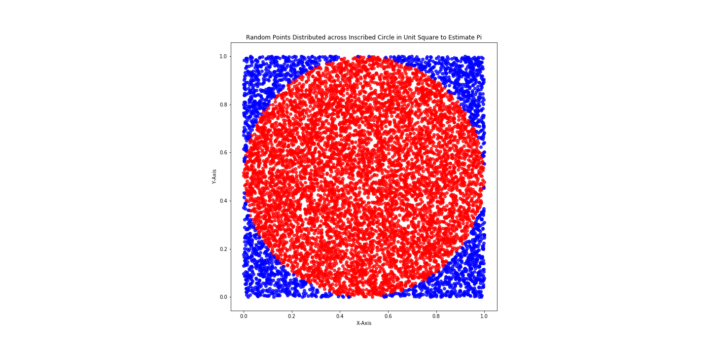

# To celebrate the end of your first week: a long warmup!

# Part 1: Numpy practice

(If you get stuck at one part, try the other part)

Run the cell below to load the machinery for testing your work, and then 

- import the numpy library with the alias 'np'


```python
#Run this cell without changes

from test_background import test_dict, run_test
```


```python
#Your code here
```

Create a variable called x that is a list of 100 0s


```python
#Your code here
```


```python
#test by running this cell

run_test(x, 'x1')
```


    'Hey, you did it.  Good job.'


Find another way to create a list of 100 0s; assign it to a new variable called y


```python
#Your code here
```


```python
#test by running this cell

run_test(y, 'y1')
```


    'Hey, you did it.  Good job.'


Turn x and y into numpy arrays


```python
#Your code here
```


```python
test_dict['x2']
```


    array([0, 0, 0, 0, 0, 0, 0, 0, 0, 0, 0, 0, 0, 0, 0, 0, 0, 0, 0, 0, 0, 0,
           0, 0, 0, 0, 0, 0, 0, 0, 0, 0, 0, 0, 0, 0, 0, 0, 0, 0, 0, 0, 0, 0,
           0, 0, 0, 0, 0, 0, 0, 0, 0, 0, 0, 0, 0, 0, 0, 0, 0, 0, 0, 0, 0, 0,
           0, 0, 0, 0, 0, 0, 0, 0, 0, 0, 0, 0, 0, 0, 0, 0, 0, 0, 0, 0, 0, 0,
           0, 0, 0, 0, 0, 0, 0, 0, 0, 0, 0, 0])


```python
#run this cell to test yer x

run_test(x, 'x2')
```


    'Hey, you did it.  Good job.'


```python
#run this cell to test yer y

run_test(y, 'y2')
```


    'Hey, you did it.  Good job.'


In both x and y, insert all of the first 100 [positive integers](https://mathworld.wolfram.com/PositiveInteger.html) in-between the 0s

With x, start inserting at index 0

With y, start at index 1

*Hint: couple ways to do this, but [here's one](https://numpy.org/doc/1.18/reference/generated/numpy.insert.html)*


```python
#Your code here
```


```python
#run this cell to test yer x

run_test(x, 'x3')
```


    'Hey, you did it.  Good job.'


```python
#run this cell to test yer y

run_test(y, 'y3')
```


    'Hey, you did it.  Good job.'


Remove all the 0s from both x and y

Use different methods of removal for x and y


```python
#Your code here
```


```python
#run this cell to test yer x

run_test(x, 'x4')
```


    'Hey, you did it.  Good job.'


```python
#run this cell to test yer y

run_test(y, 'y4')
```


    'Hey, you did it.  Good job.'


# Part 2: Estimating pi (with vis!)

(This is a little bit more math-y than the content we've covered so far)

First import pyplot from matplotlib under the alias plt

Also, run the commend %matplotlib inline so that jupyter renders the plots inside the notebook


```python
#Your code here
```

Picture a circle perfectly circumscribed inside a unit square

or run the cell below


```python
#run this cell without changes

square = plt.Rectangle((0,0), 1,1, fill=False, color='blue')
circle = plt.Circle((.5, .5), .5, color='yellow')

fig, ax = plt.subplots()
ax.add_artist(square)
ax.add_artist(circle)

#set the axis a little beyond the square
ax.set_xlim(right=1.5)
ax.set_ylim(top=1.5)

#make the aspect ratios on dimensions the same
ax.set_aspect('equal')

#remove the border from the top and right side of the figure
ax.spines['top'].set_visible(False)
ax.spines['right'].set_visible(False)

plt.show()
```


#### Math refresher

The area of the unit square is 1

The radius of the circle is $\frac{1}{2}$, and the area of the circle is $\pi \times (\frac{1}{2})^2 = \frac{\pi}{4}$

If we randomly throw points inside the square: 

$$ \lim \limits_{points \to \infty} (\mbox{area covered by all points}) = 1 $$

and

$$ \lim \limits_{{points} \to \infty} (\mbox{area covered by points in circle}) = \frac{\pi}{4} $$

So, if we randomly throw *a finite number* of points in the square,

 $$ \frac{\mbox{points that land in circle}}{\mbox{total points}} \approx \frac{\pi}{4} $$

and

$$ 4 \times \frac{\mbox{points that land in circle}}{\mbox{total points}} \approx \pi $$

#### Look just tell me what we're doing here

We're going to create a plot that, inside of a unit square whose lower-left corner is at (0,0):
- plots 1000 random points
- colors them differently if they're inside or outside an inscribed circle

Then, we'll calculate our estimate for pi 

Two s t r e t c h goals:
- calculate the error of the estimate
- turn our work into a function that can recreate what we've done with an arbitrary number of points

#### Let's graph

First we're going to create the points to throw inside the square.

- Use numpy to create a variable `x` that has 1000 randomly drawn floats (a numerical data type which has decimals, as opposed to `integers` which don't) between 0 and 1.

- Use numpy to creat another variable `y` that has a different set of 1000 randomly-drawn floats b/t 0 and 1.

These are the x and y coordinates for the random points we'll throw at the square and inscribed circle

- Also, run `np.random.seed(33)` at the top of the cell

This "seeds" the pseudorandom number generator to produce the same numbers each time the variables are instantiated

[*Hint*](https://numpy.org/devdocs/reference/random/generated/numpy.random.random.html?highlight=random%20random#numpy.random.random)


```python
#Your code here
```


```python
#run this cell to check yer x

run_test(x, 'x5')
```


    'Hey, you did it.  Good job.'


```python
#run this cell to check yer y

run_test(y, 'y5')
```


    'Hey, you did it.  Good job.'


The x and y coordinates of the points inside the circle are 
$$ (x^2 + y^2)<=\frac{1}{2} $$

Select all the points in x inside the circle and assign them to the variable inside_x

Do the same thing for the points in y, and assign them to the variable inside_y


*Hint 1: For 1D arrays, addition and multiplication operates element by element.  Boolean selection of a 1D array also operates element by element.* 

*Eg if `ex1 = np.array([1,2,3])` and `ex2 = np.array([5,6,7])`*, 

\begin{align}
ex1[ex1*5+ex2*10<80] \\
= \\ 
\mbox{"at each index value}, \\
\mbox{if (the value of ex1 at that index)*5 +} \\
\mbox{(the value of ex2 at that index)*10 < 80}, \\
\mbox{include the value of ex1 at that index"} \\
= \\
[1,2] 
\end{align}


*Hint 2: the formula for a circle centered at (h,k) with radius r is* 
    $$(x-h)^2 + (y-k)^2 = r^2$$
*Where is the center of a circle inscribed in a unit square whose lower-left corner is at (0,0)?  Are points inside the circle greater than or less than $r^2$?*


```python
#Your code here
```


```python
#run this cell to check inside_x

run_test(inside_x, 'inside_x')
```


    'Hey, you did it.  Good job.'


```python
#run this cell to check inside_y

run_test(inside_y, 'inside_y')
```


    'Hey, you did it.  Good job.'


Do the same thing for the points that lie within the square but outside the circle

Ie, select all the points in x and y that satisfy the condition
$$ (x^2 + y^2)>\frac{1}{2} $$
assign them to the variables outside_x and outside_y, respectively


```python
#Your code here
```


```python
#run this cell to check outside_x

run_test(outside_x, 'outside_x')
```


    'Hey, you did it.  Good job.'


```python
#run this cell to check outside_y

run_test(outside_y, 'outside_y')
```


    'Hey, you did it.  Good job.'


Now, create a scatter plot of the "inside circle" points.  Color them blue, with alpha=.8 and edgecolor=None.

Create another scatter plot of the "outside circle" points.  Color them red, same alpha / edgecolor as above.

Plot both scatter plots in the same graph.

Call the title of the graph "Random Points Distributed across Inscribed Circle in Unit Square to Estimate Pi".  


```python
#Your code here
```

You should produce a figure like the one below (which has a figsize(20,10) and used ax.set_aspect('equal'), fyi)



#### Calculate Estimate

Now, calculate your $\pi$ estimate

Create the following variables:
- the number of pts inside the circle
    - name this variable pts_in_circle
    
    
- the number of pts outside the circle
    - name this variable pts_out_circle
    
    
- an estimate for $\pi$ that uses pts_in_circle and pts_out_circle
    - name this variable pi_est

**S t r e t c h goal 1**
    
- a calculation of the pct error of pi_est 
    - name this variable pi_est_error_pct
    
Print a sentence using the above variables that includes the estimate of pi and how many points it's based on 

(and the error, if you get that far)


```python
#Your code here
```


```python
#run this cell to test pts_in_circle, pts_out_circle, pi_est

[
    print(pair[1]+f'? {run_test(pair[0], pair[1])}')
    for pair in 
    zip(objects, obj_names)
]
print()
```

    pts_in_circle? Hey, you did it.  Good job.
    pts_out_circle? Hey, you did it.  Good job.
    pi_est? Hey, you did it.  Good job.
    


```python
#run this cell to test pct error

run_test(pi_est_error_pct, 'pi_est_error_pct')
```


    'Hey, you did it.  Good job.'


```python
#run this cell to test rounded pct error

run_test(pi_est_error_pct_rounded, 'pi_est_error_pct_rounded')
```


    'Hey, you did it.  Good job.'


**S t r e t c h goal 2**


Turn your work into a function that:

- can take as a parameter an arbitrary number of points to estimate pi

- prints a graph like the one above

- returns {'pi_estimate': pi_est, 'est_error_pct': pi_est_error_pct} 


```python

```
